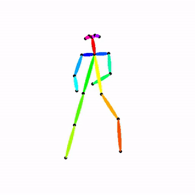

## Music-oriented Dance Video Synthesis with Pose Perceptual Loss

Pytorch implementation for this paper by [Xuanchi Ren](xuanchiren.com), Haoran Li, Zijian Huang, [Qifeng Chen](https://cqf.io/)

[Paper](https://arxiv.org/abs/1912.06606)

The demo video is shown at: https://youtu.be/0rMuFMZa_K4

The dataset and the code for training and test is released. And the instrution on dataset is still under construction.

### Some Demo:



More samples can be seen in [demo video](https://youtu.be/0rMuFMZa_K4).

### Requirement:
python 3.5 + pytorch 1.0

For the Testing part, you should install ffmpeg for music video.

We use tensorboardX for logging. If you don't install it, you can just comment the line in train.py.


### Training:
This training process is intended for the clean part dataset, which could be downloaded [here](https://drive.google.com/file/d/1o79F2F7-dZ7Cvpzf6hsVMwvfNg9LM3_K/view?usp=sharing).
1. Download the dataset and put it under ./dataset

2. Run
```python
python train.py
```
training script will load config of config.py. If you want to train the model on other datasets, you should change the config in config.py.

### Testing:
If you want to use the pretrained model, you can firstly download it from [here](https://drive.google.com/file/d/1NFDD9wbwx-BAIss89Bck2xfxKmD7Z8Rb/view?usp=sharing), put it under "pretrain_model" and change the path of get_demo.py to "./pretrain_model/generator_0400.pth".
1. Run
```
python get_demo.py --output the_output_path
```
2. Make the output skeleton sequence to music video
```
cd Demo
./frame2vid.sh
```
Note that you should change the paths and the "max" variable in frame2vid.sh.

### Pose2Vid:
For this part, we adapt the method of the paper "Everybody dance now".

And We use this pytorch [implementation](https://github.com/CUHKSZ-TQL/EverybodyDanceNow_reproduce_pytorch).

### Metrics:

For the proposed cross-modal metric in our paper, we re-implement the paper: Human Motion Analysis with Deep Metric Learning (ECCV 2018).

The implementation of this paper can be seen at: https://github.com/xrenaa/Human-Motion-Analysis-with-Deep-Metric-Learning


### Dataset:
To use the dataset, please refer the notebook "dataset/usage_dataset.ipynb"

As state in the paper, we collect 60 videos in total, and divide them into 2 part according to the cleaness of the skeletons.

The clean part(40 videos):
https://drive.google.com/file/d/1o79F2F7-dZ7Cvpzf6hsVMwvfNg9LM3_K/view?usp=sharing

The noisy part(20 videos):
https://drive.google.com/file/d/1pZ3JszX7393dQwm6x6bxxbiKb0wLIJGE/view?usp=sharing

To support further study, we also provide other collected data:

Ballet:
https://drive.google.com/open?id=1NR6S20EI1C37fsDhaNkRI_P1MLT9Ox7u

Popping:
https://drive.google.com/file/d/1oLIxtczDZBvPdCAk8wuiI9b4FsnCItMG/view?usp=sharing

Boy_kpop:
https://drive.google.com/file/d/14-kEdudvaGLSapAr4prp4D67wzyACVQt/view?usp=sharing

Besides, we also provide the BaiduNetDisk version:
https://pan.baidu.com/s/15wLkdPnlZiCxgnPv51hgpg
(includes all the dataset)

### Questions
If you have questions for our work, please email to xrenaa@connect.ust.hk.
