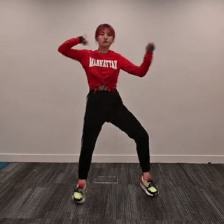
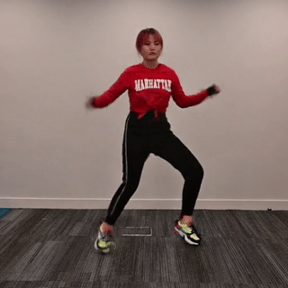

## Music-oriented Dance Video Synthesis with Pose Perceptual Loss

Pytorch implementation for this paper by Xuanchi Ren, Haoran Li, Zijian Huang, [Qifeng Chen](https://cqf.io/)

[Paper](https://arxiv.org/abs/1912.06606)

The demo video is shown at: https://youtu.be/0rMuFMZa_K4

The code for training and test is released. And the instrution on dataset is still under construction.

### Some Demo:



More samples can be seen in [demo video](https://youtu.be/0rMuFMZa_K4).

### Training:
This training process is intended for the clean part dataset, which could be downloaded [here](https://drive.google.com/file/d/1o79F2F7-dZ7Cvpzf6hsVMwvfNg9LM3_K/view?usp=sharing).
1. Download the dataset and put it under ./dataset

2. Run
```python
python train.py
```
training script will load config of config.py

### Testing
Run
```python
python get_demo.py --output *the_output_path*
```

### Metrics

For the proposed cross-modal metric in our paper, we re-implement the paper: Human Motion Analysis with Deep Metric Learning (ECCV 2018).

The implementation of this paper can be seen at: https://github.com/xrenaa/Human-Motion-Analysis-with-Deep-Metric-Learning


### Dataset:
As state in the paper, we collect 60 videos in total, and divide them into 2 part according to the cleaness of the skeletons.

The clean part(40 videos):
https://drive.google.com/file/d/1o79F2F7-dZ7Cvpzf6hsVMwvfNg9LM3_K/view?usp=sharing

The noisy part(20 videos):
https://drive.google.com/file/d/1pZ3JszX7393dQwm6x6bxxbiKb0wLIJGE/view?usp=sharing

To use the dataset, please refer the notebook "dataset/usage_dataset.ipynb"

To support further study, we also provide other collected data which is not used in the paper(limit to time),

Ballet:
https://drive.google.com/open?id=1NR6S20EI1C37fsDhaNkRI_P1MLT9Ox7u

Popping:
https://drive.google.com/file/d/1oLIxtczDZBvPdCAk8wuiI9b4FsnCItMG/view?usp=sharing

Boy_kpop:
https://drive.google.com/file/d/14-kEdudvaGLSapAr4prp4D67wzyACVQt/view?usp=sharing

Besides, we also provide the BaiduNetDisk version:
https://pan.baidu.com/s/15wLkdPnlZiCxgnPv51hgpg
(includes all the dataset)

